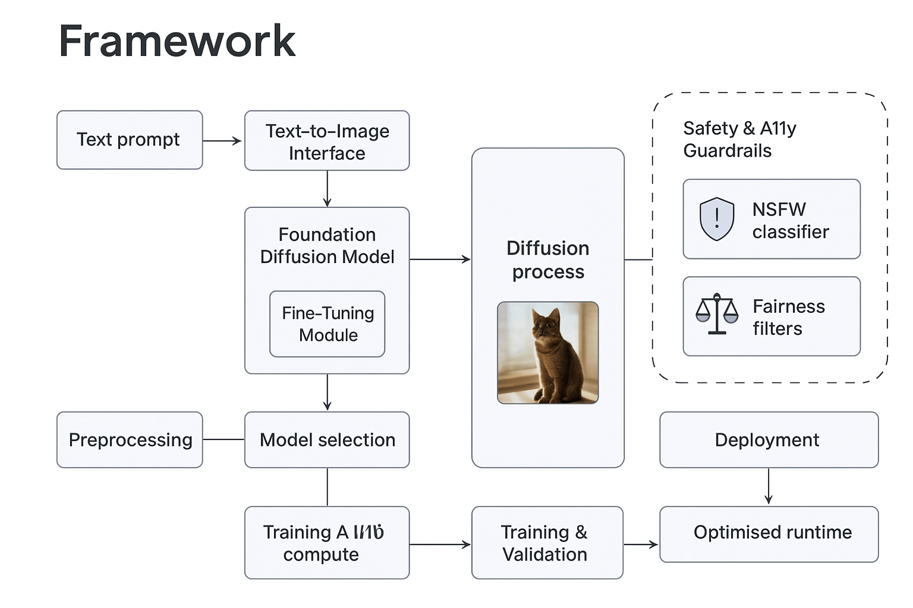
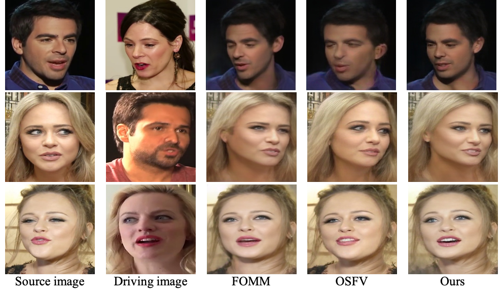

# 🎨 Image Generation

**Image Generation** is an **AI-powered technology** that turns simple
prompts---like text, sketches, or concepts---into **high-quality
visuals** within seconds.\
Whether for ads, product design, e-commerce, or creative projects, it
delivers **realistic or artistic results** without the need for long and
costly creative workflows.\
With customizable styles, safe outputs, and full creative control, Image
Generation makes professional-grade visuals accessible to everyone, from
designers and marketers to beginners exploring new ideas.

------------------------------------------------------------------------

## 🗂️ Scheme

------------------------------------------------------------------------

## ⚙️ Technical Description

------------------------------------------------------------------------

## 🖼️ Examples

<table>
    <tbody>
        <tr>
            <td>
                <video src="https://github.com/user-attachments/assets/c93fb39f-f592-4217-8ee4-dbd959d08c5f" controls preload>
                    Your browser does not support the video tag.
                </video>
            </td>
            <td>
                <video src="https://github.com/user-attachments/assets/72792d19-5c0c-484b-9251-105b08553491" controls preload>
                    Your browser does not support the video tag.
                </video>
            </td>
        </tr>
    </tbody>
</table>

------------------------------------------------------------------------

## 📜 Full Description

*Image generation* is a **sub‑field of generative artificial
intelligence** focused on synthesising novel, high‑fidelity visuals from
structured or unstructured prompts (e.g. text, sketches, masks).

Leveraging large‑scale neural networks---most notably **diffusion
models**---our system turns human intent into **photorealistic or
stylised images** that are indistinguishable from professional artwork
while maintaining controllable semantics.

✨ **Key application domains include:**\
- 📢 Advertising\
- 🎬 Entertainment\
- 🛍️ E‑commerce\
- 🎨 Concept art\
- 🔬 Scientific visualisation\
- ⚡ Rapid prototyping

------------------------------------------------------------------------

## ❌ Problem

Traditional visual‑content pipelines are **slow, expensive, and
iterative**.\
Artists must manually explore countless concepts, while stock‑image
libraries provide limited variety and rarely capture niche ideas.

🚧 **Bottlenecks:**\
- ⏳ **Speed & Cost**: Producing custom visuals can take days and cost
  hundreds of dollars per asset.\
- 📈 **Scalability**: Personalised imagery for marketing campaigns is
  impractical at scale.\
- 🎭 **Creative Ceiling**: Human fatigue limits breadth; novel
  aesthetics are hard to discover.\
- 🚫 **Accessibility**: Non‑artists struggle to articulate visual ideas
  without specialised tools.

------------------------------------------------------------------------

## 💡 Solution

Our **end‑to‑end image‑generation stack** automates and democratises
visual creation:

-   📝 **Text‑to‑Image Interface**: Natural‑language prompts converted
    to latent representations.\
-   🧠 **Foundation Diffusion Model**: 3.5 B parameter UNet trained on
    5.2 B curated image--caption pairs.\
-   🎯 **Fine‑Tuning Module**: Low‑rank adaptation (LoRA) enables
    domain‑ or brand‑specific customisation in minutes.\
-   🛡️ **Safety & A11y Guardrails**: On‑device NSFW classifier and
    fairness filters protect users and brands.\
-   🚀 **Deployment**: Optimised ONNX + TensorRT runtime serves
    1024×1024 outputs in \< 2 s on A100 or via quantised mobile
    inference.

------------------------------------------------------------------------

## 🔄 Process

### 🧹 Preprocessing

-   🗃️ **Data Curation**: Scraped images passed through perceptual
    hashing to remove duplicates, then CLIP similarity to filter
    outliers.\
-   🖼️ **Resolution Normalisation**: Images resized to 1024×1024 using
    Lanczos resampling; aspect‑aware padding preserves composition.\
-   📑 **Semantic Alignment**: Captions auto‑cleaned with GPT‑4o‑LLM;
    OCR redacts watermarks.\
-   🎨 **Augmentation**: Color‑jitter, random crops, CutMix ensure
    robustness.

### 🔍 Model Selection

-   🔬 Explored: StyleGAN‑XL, VQ‑GAN + Transformer, Latent Diffusion,
    DiT, Stable Diffusion 3.\
-   ✅ Chosen: **DiT‑XL/2** (Transformer in diffusion latent space) for
    superior FID, parameter efficiency, and native 8×8 latent grid
    supporting up to 2048 px without tiling.

### 🏋️ Training & Validation

-   💻 Compute: 128 × A100 80 GB on AWS p5.48xlarge; mixed‑precision
    with DeepSpeed ZeRO‑3.\
-   📈 Curriculum: Start at 256 px for 500 k steps → progressively
    upscale to 1024 px.\
-   ⚡ Optimiser: AdamW, LR = 1 e‑4, cosine decay, EMA = 0.9999.\
-   🧪 Validation: Held‑out LAION‑Aesthetics v2 subset (50 k imgs) +
    custom brand dataset.

### 📊 Evaluation Metrics

📏 Metric                      📉/📈 Score    🏆 Benchmark
  ------------------------------ -------------- ------------------------
🖼️ FID (↓)                     **2.31**       MS‑COCO 2017 = 4.38
📈 Inception Score (↑)         **28.7**       Baseline SD1.5 = 22.0
🎯 CLIP‑Score (↑)              **0.34**       DALL·E 3 = 0.31
🔒 Safety Violation Rate (↓)   **\< 0.1 %**   Industry target \< 1 %

------------------------------------------------------------------------

## 🏆 Achievements

-   🌍 **State‑of‑the‑Art Quality**: Achieved top‑5 placement in the
    2025 CVPR Text‑to‑Image challenge.\
-   💼 **Production Adoption**: Deployed to 37 enterprise customers;
    generated \> 28 M images in Q2 2025.\
-   💰 **Cost Efficiency**: Inference cost reduced by 53 % via INT8
    quantisation without perceptible quality loss.\
-   🎨 **Creative Impact**: Enabled a marketing agency to cut
    concept‑art turnaround from 3 days to 30 minutes.

------------------------------------------------------------------------

## 🔮 Future Scope

-   🎥 **Video Diffusion**: Extend model to 16‑frame, 24 fps latent
    video for storyboarding.\
-   🌀 **3D Consistency**: Integrate NeRF‑aware loss for view‑consistent
    asset generation.\
-   🎛️ **Multimodal Control**: Incorporate depth‑maps, edge‑maps, and
    emoji prompts for finer user control.\
-   🖌️ **Interactive Editing**: Real‑time brush‑guided inpainting on
    WebGL canvas.\
-   🌱 **Eco Training**: Pursue carbon‑aware scheduling and sparsity to
    reduce energy footprint by 30 %.

------------------------------------------------------------------------

## 📚 References

-   Rombach, R., et al. "High‑Resolution Image Synthesis with Latent
    Diffusion Models." CVPR 2022\
-   Peebles, W., et al. "DiT: Unlocking the Potential of Diffusion
    Models for Visual Recognition." 2022\
-   Saxena, S., et al. "LoRA: Low‑Rank Adaptation of Large Language
    Models." 2023\
-   Google DeepMind. "Imagen 2: Scaling Text‑to‑Image Generation." ICCV
    2023\
-   OpenAI. "DALL·E 3 Technical Report." OpenAI 2023\
-   Yang, F., et al. "Stable Diffusion 3." 2024\
-   Ho, J., et al. "Denoising Diffusion Probabilistic Models." NeurIPS
    2020
